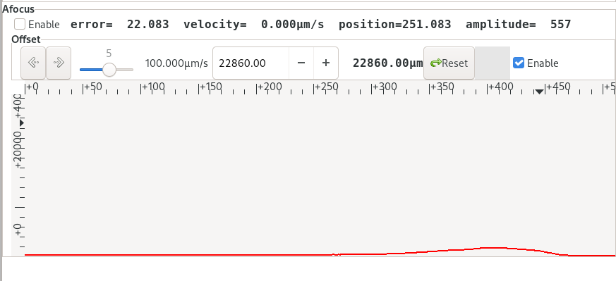
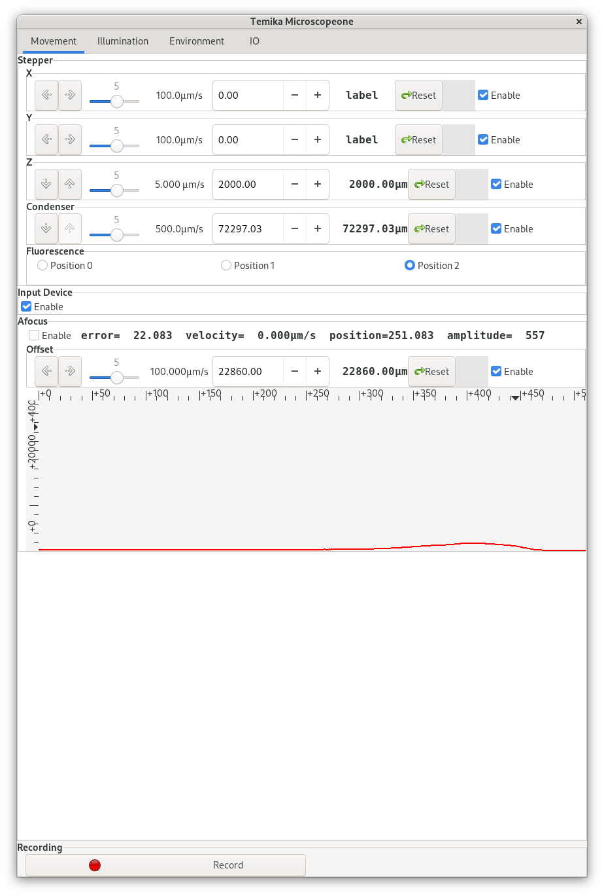
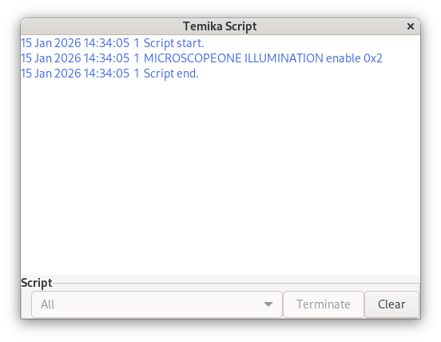

# Advanced Controls

This section covers the higher-control features exposed through the Temika GUI once the basic workflow is understood.

## Autofocus

The `Movement` tab includes an `Afocus` section with:

- autofocus enable
- autofocus offset
- sensor graph



Use autofocus when:

- the sample is compatible with the optical lock signal
- long runs need drift compensation
- scripted imaging returns repeatedly to the same optical plane

Disable autofocus before large manual `Z` moves or scripted repositioning, then re-enable it and wait for lock once motion has finished.

## Fluorescence position

The `Movement` tab includes fluorescence position selection. The filter module on the microscope has three positions so that more specific filter cubes can be added later. Switching between filter positions can be done either from the GUI or through XML commands. The default operating practice is to keep the microscope in `Position 1` unless a specific validated workflow requires a different setting. The default filter is a notch-filter-based arrangement and so some fluorophores may be visible in two or more channels. Always check fluorophore excitation and emission spectra before planning an experiment or assigning channels.

Useful reference for checking excitation and emission overlap:
[Thermo Fisher Fluorescence SpectraViewer](https://www.thermofisher.com/order/fluorescence-spectraviewer/#!/)

| Position | Intended Use | Excitation Filter | Dichroic | Emission Filter | Notes |
|---|---|---|---|---|---|
| 0 | Optional cube slot | TODO | TODO | TODO | Available for a more specific cube |
| 1 | Default installed notch-filter cube | TODO | TODO | TODO | Current standard operating position |
| 2 | Optional cube slot | TODO | TODO | TODO | Available for a more specific cube |

If there is no fluorescent image:

1. Confirm the selected LED channel is enabled.
2. Confirm the fluorescence position is correct.
3. Confirm the filter set installed at that position matches the fluorophore.

The full filter specifications still need to be added to [Overview](../overview.md).

## Camera-specific settings

`Camera Control` exposes camera-specific GenICam features defined by the manufacturer. These are the place to set items such as:

- exposure time
- trigger mode
- acquisition mode
- transmission state

When recording a validated imaging workflow, note both the GUI values and the corresponding XML or GenICam feature names used by automation.

Screenshot placeholder:
`TODO: add confirmed Camera Feedback or advanced camera-feature screenshot if these windows will be documented in detail.`

## Illumination sequences and trigger modes

The `Illumination` tab can build synchronized multi-colour sequences.

- `Number`: total number of sequencer steps
- `Index`: currently displayed step
- `Enable`: turns the sequencer on
- step checkboxes: select the LED active in each step

This is the GUI equivalent of the XML commands:

```xml
<illumination>
  <sequencer_enable>ON</sequencer_enable>
  <sequencer_step number="2">0x22</sequencer_step>
  <sequencer_number>5</sequencer_number>
  <sequencer_index>3</sequencer_index>
</illumination>
```

## Environment and temperature control

Open `Microscopeone -> Environment`.



This tab exposes:

- temperature plots
- sensor readouts (`TC`, `RTD`, `I2C`, enclosure, internal, IO)
- peltier and power channels
- enclosure control
- LED and fan duty-cycle controls
- buzzer control

The GUI allows both open-loop and feedback-controlled operation depending on the selected channel.

Use the temperature controls carefully:

- confirm which power channel is connected to the actual heater or peltier
- confirm the active sensor type
- enable feedback only when the sensor mapping is known
- record setpoints in experiment notes for long runs

## Script window



The `Script` window shows script interpreter output and running script status.

- Multiple scripts can run in parallel.
- `Terminate` stops the selected script.
- `Clear` clears the output display.

Use this window whenever XML automation is launched from within Temika so that execution progress and failures remain visible.
