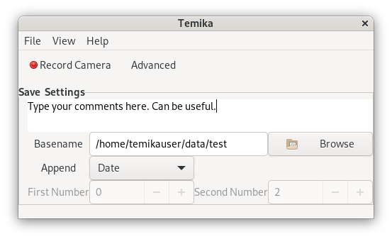
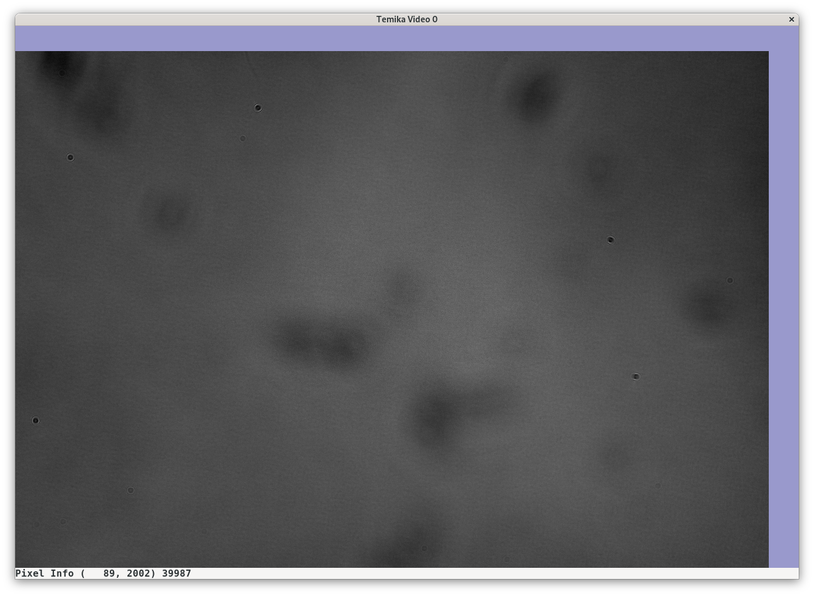
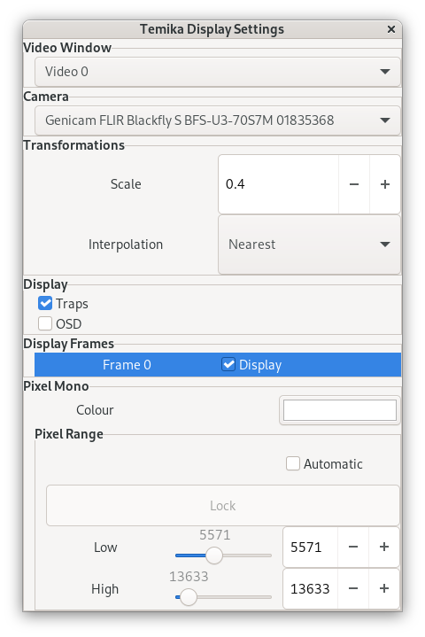
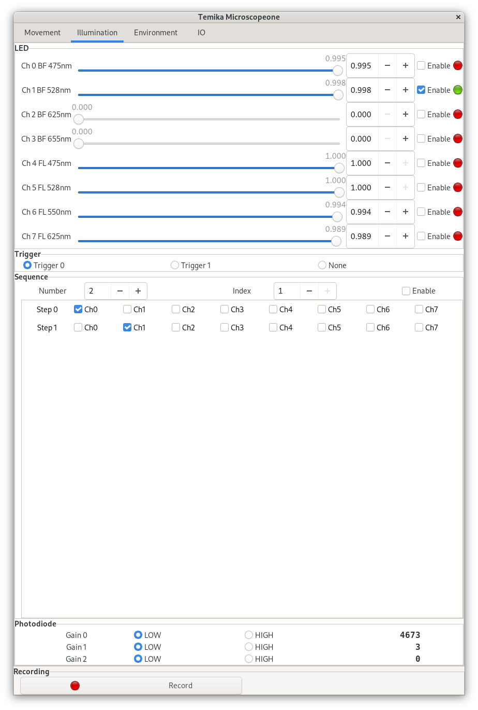

# Before starting

Always check the position of the lens, condensor and stage before operation to avoid collision damage. The field diaphragm and aperture diaphragm should normally be opened fully for standard setup unless a specific imaging mode requires adjustment.

## Start the GUI

1. Open a terminal on the Temika control workstation.
2. Run `temika`.
3. Watch the terminal for status messages.
4. Confirm that the `Temika` main window opens.
5. If a working camera is connected, confirm that a `Temika Video` window opens automatically.

The manuals indicate that `temika` running by itself is enough to expose microscope control to external software and XML scripts. The GUI windows can be used for interactive operation and settings changes.  Once the software is running, the 4 motorised axes can all be controlled via the joystick.

TODO: Takea photo of joystcik and explain operaiton.

## Main window

The main window provides:

- `File`, `View`, and `Help` menus
- `Record Camera` shortcut
- `Advanced` shortcut
- save settings for output naming and annotation

### Save settings

| Control | Purpose | Notes |
|---|---|---|
| Comment field | Free-text annotation saved into recorded files | Use for experiment notes |
| `Basename` | Base output path and filename stem | Should point to the data directory |
| `Append` | Filename suffix policy | `Nothing`, `Date`, or `Two Numbers` |
| `First Number` / `Second Number` | Manual numbering fields | Used when `Append = Two Numbers` |

The data partition is RAID0: which is not fault-tolerant. Always copy your data to reliable storage after experiments.

## Open the working windows

From the `View` menu, you can open various windows needed for specific settings and tasks:

- `Video (number)`
- `Display Settings`
- `Camera Control`
- `Microscopeone`
- `Script` when running XML scripts

For routine interactive imaging, `Video 0`, `Camera Control`, and `Microscopeone` are the usual minimum set.

## Video window

The video window displays the live camera stream.

- A purple border at the top and right marks the full camera field of view.
- When you hover over the video window the value of pixel at the cursor poisiton is shown.  This can be a good way to check exposure especially if the display window has set a specific pixel range.

## Display Settings Window

Use `Display setttings` to:

- Resize the window or change scale to see the full sensor area (0.5 is often a good starting point) 
- Change the pixel range, so that display is clearer - but note that display adjustments are visualization-only and are not recorded into the image data.  

## Camera Control Window

Use `Camera control` to:

- select the active camera
- rename the displayed camera name if needed
- enable or disable video transmission
- the "features tree" provides camera-specific GenICam features
- send a software trigger
- start recording the camera video stream

The exact camera features depend on the camera model and vendor feature set.

## Move the microscope

Open `Microscopeone` and use the `Movement` tab.

### Stepper controls

The `Stepper` section contains rows for:

- `X` and `Y`: stage motion
- `Z`: focus
- `Condenser`: condenser height

Each row provides:

- arrow buttons for manual motion
- a speed slider
- direct numeric position entry
- a live position label
- `Reset` to zero the coordinate
- `Enable` to allow or block motion

The default speeds depend on the axes.  Be careful when increasing these speeds to the maximum to avoid damage. 

### Start up procedure

Start from a known reference whenever possible.

1. Lower `Z` to the lowest safe position and zero it.
2. If you want to use absolute XY positioning (for example when imaging a multi-well plate programatically) then move the XY to their minimum values and zero both.
2. Lower the condenser to the lowest position.  **This should be done with no plate or sample holder in the stage otherwise the condensor will hit it**.
3. Zero the condenser position.

This routine makes it easier to set condenser and focus to matching values for a repeatable optical path.

### Axis enable

`Enable` disables an axis completely. This prevents accidental motion, but it also affects programmatic control. If an axis refuses to move from software, check whether it has been disabled in the GUI.

## Control illumination

Open `Microscopeone -> Illumination`.

Use this tab to:

- set LED intensity per channel
- enable or disable each LED channel
- select trigger synchronization mode
- define multi-step illumination sequences
- monitor photodiode readouts

For basic operation:

1. Select the required brightfield or epi channel.
2. Set the intensity.
3. Enable only the channel you want to use.
4. Use `Trigger 0` or `Trigger 1` when synchronizing illumination to the camera.
5. Use `None` only when unsynchronized continuous illumination is intended.

## Take an image

For a single interactive acquisition:

1. Set the save basename in the main window.
2. Confirm the required camera is selected in `Camera Control`.
3. Set illumination in `Microscopeone -> Illumination`.
4. Move to the desired position in `Microscopeone -> Movement`.
5. Focus using `Z`, or use autofocus if required.
6. Use software trigger or record control from `Camera Control`.

For streamed recording, the `Record Camera` shortcut on the main window can be used once the save settings are configured.
