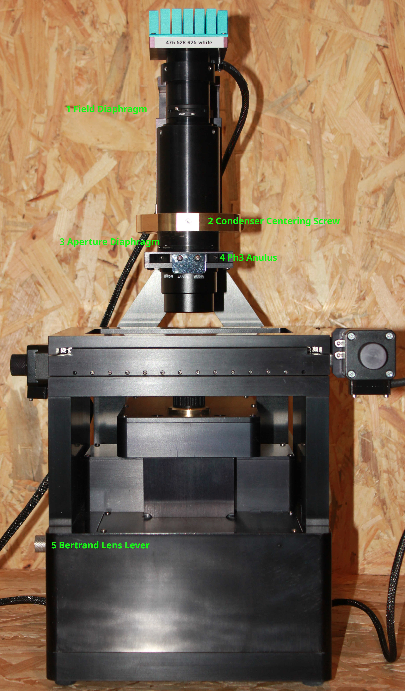
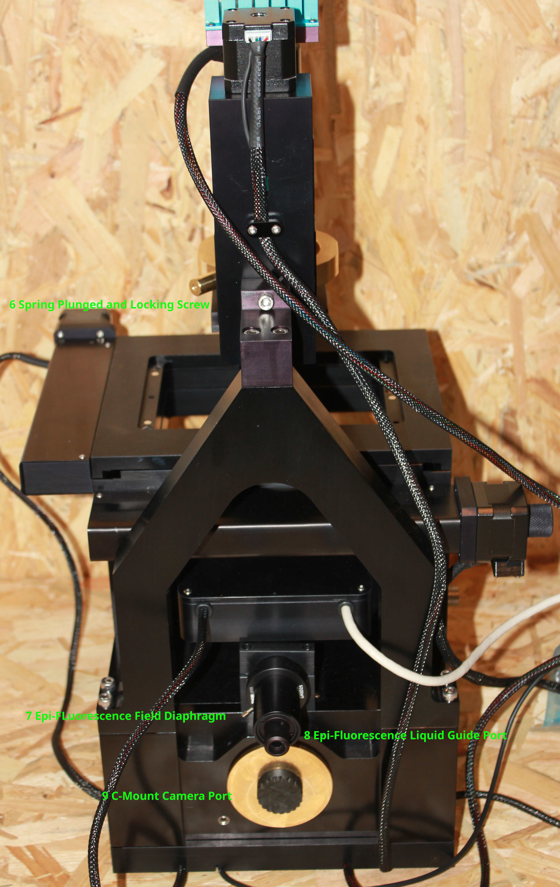
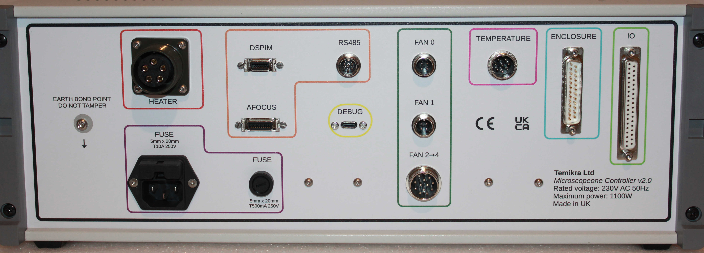
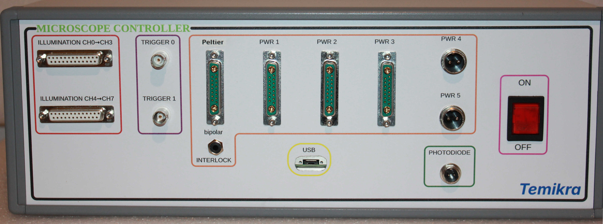

# Overview

The Temika microscope is a brightfield and epi-fluorescent microscope designed for automated imaging. It combines motorized XY stage motion, motorized focus (`Z`), motorized condenser height, programmable illumination, temperature control, and an optical autofocus system similar in operation to the Nikon PFS.

## Core capabilities

- Imaging modes: brightfield and epi-fluorescence
- Illumination channels: 8 total
- Motion axes: motorized `X`, `Y`, `Z`, and condenser
- Stage accessories: interchangeable inserts for cover slides, multiwell plates, and custom sample holders
- Temperature module: controllable from the GUI or through automation
- Autofocus: optical lever with offset and PID-style control parameters

## Optical and illumination specification

### LED channels

The microscope comes with the following illumination channels:

| Channel | Mode | Nominal LED Wavelength | Notes |
|---|---|---|---|
| Ch0 | Brightfield | 475 nm | From GUI screenshot in `temika_manual.odt` |
| Ch1 | Brightfield | 528 nm | From GUI screenshot in `temika_manual.odt` |
| Ch2 | Brightfield | 625 nm | From GUI screenshot in `temika_manual.odt` |
| Ch3 | Brightfield | 655 nm | From GUI screenshot in `temika_manual.odt` |
| Ch4 | Epi | 385 nm | From GUI screenshot in `temika_manual.odt` |
| Ch5 | Epi | 475 nm | From GUI screenshot in `temika_manual.odt` |
| Ch6 | Epi | 528 nm | From GUI screenshot in `temika_manual.odt` |
| Ch7 | Epi | 625 nm | From GUI screenshot in `temika_manual.odt` |

The integrated chip LEDs can be changed if required.

### Fluorescence filters

The microscope is shipped with a single filter cube using notch filters in both the excitation and emission paths.

`TODO: add link to the supplied notch-filter spectrum file when it is available.`

Because this is a notch-filter-based arrangement, some fluorophores may be visible in two or more channels. Always check fluorophore excitation and emission spectra before planning an experiment or assigning channels.

The filter module on the microscope has three positions so that more specific filter cubes can be added later. Switching between filter positions can be done either from the GUI or through XML commands.

| Position | Intended Use | Excitation Filter | Dichroic | Emission Filter | Notes |
|---|---|---|---|---|---|
| 0 | Optional cube slot | TODO | TODO | TODO | Available for a more specific cube |
| 1 | Default installed notch-filter cube | TODO | TODO | TODO | Current standard operating position |
| 2 | Optional cube slot | TODO | TODO | TODO | Available for a more specific cube |

## Motion and sample handling

| Subsystem | Description | Notes |
|---|---|---|
| XY stage | Motorized stage for sample positioning | Used for manual movement and scripted scans |
| Focus (`Z`) | Motorized objective/sample focus axis | Works with autofocus system |
| Condenser | Motorized condenser height | Can be zeroed relative to focus for repeatable setup |
| Inserts | Cover slide, multiwell plate, and other holders | Confirm insert list and part numbers when available |

## Temperature control

The microscope includes a temperature control module with monitored sensors and controllable power channels. The GUI exposes temperature plots, readback values, and feedback enable controls. Programmatic control is also available through `microscopeone` XML commands such as `<pwr number="0"><feedback>...</feedback></pwr>`.

## Autofocus

Temika provides an optical autofocus subsystem (`afocus`) that behaves like a hardware lock rather than a software image-sharpness search. 

## Camera
The microscope comes with a Teledyne monochromatic 7.1 MP camera.  Full specification can be found here:
https://www.teledynevisionsolutions.com/en-gb/products/blackfly-s-usb3/?model=BFS-U3-70S7M-C&segment=iis&vertical=machine+vision

Other cameras with a C-mount adapter can be fitted to the camera port.

## Hardware photos

### Front view

### Rear view

### Electronics connections

